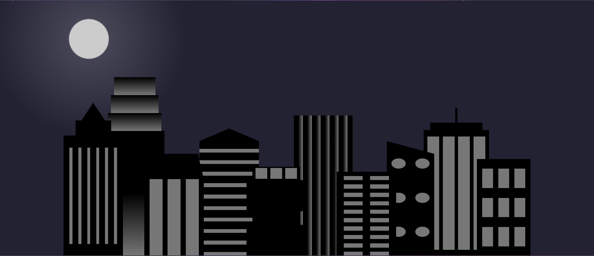

# 🌆 City Skyline

Demo HTML/CSS project που δημιουργεί ένα **skyline πόλης** με buildings, gradients και responsive εναλλαγή **Day / Night**.

## 🌐 Live Demo
🔗 [Δες το project εδώ](https://antoniaske.github.io/city-skyline/)

## 🕹️ Περιγραφή
Το **City Skyline** είναι ένα responsive CSS-only project.  
Όταν η οθόνη μικραίνει (ή όταν προβάλλεται σε κινητό), το φόντο και τα χρώματα αλλάζουν, δημιουργώντας **εφέ νύχτας** 🌙.

Χρησιμοποιεί:
- CSS **variables** για τα χρώματα
- **linear** & **radial gradients**
- **flexbox** για τη διάταξη
- **media query** για την αλλαγή σε night mode

## 🧱 Δομή
- `index.html` → markup (δομή των buildings)
- `styles.css` → όλα τα styles, gradients και responsive ρυθμίσεις

## 🖼️ Screenshots

### 🌞 Day Mode

### 🌙 Night Mode

